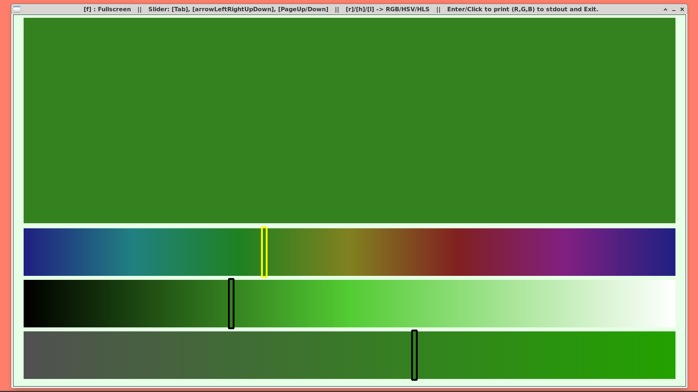

# colorChoice

Interactive color choice/selection application built with OpenCV. It allows to visually select a color using RGB or HSV/HSL sliders and outputs the chosen color in both hexadecimal and RGB format to stdout along with exact or nearest css3 color name. 

Both keyboard-only and mouse-only interaction allow to adjust color values and provides real-time feedback through a large area with chosen color showing which color will result from moving a slider to a new position by displaying this color in the slider strip.

# Key Features:
<ul><li><b>TEXT- and ICON/BUTTON FREE</b> Fullscreen Mode</li>
</li><li><b>RGB, HSL, HSV Modes:</b> Switch between different color models (RGB, HSV, HLS) using the r, h, and l keys.
</li><li><b>	Interactive Sliders:</b> Use Tab to change active color channel and arrow keys and PageUp/PageDown to adjust the color channel values. Move all three sliders at the same time using the Up/Down arrow keys. The sliders are visualized as horizontal strips of colors. Hit Enter to confirm color selection and exit the application. 
</li><li><b>Mouse Input:</b> Clicking inside the sliders adjusts the color values, while clicking in the upper large square with selected color confirms the color selection and exits the application.
</li><li><b>Fullscreen Mode</b>: Pressing the f key switches to <b><i>TEXT-FREE</i><b> fullscreen mode.
</li><li><b>Output:</b> Upon confirming a color with Enter or mouse click, the color is printed to stdout in both hex and RGB formats.
</li><li><b>Color Name:</b> In addition to #RRGGBB and rgb(R,G,B) output the exact or nearest css3 color name is determined and printed.
</li></ul>

The pure Python application is build following the guidelines of the oOo approach to usage of own computer for private purposes and programming it, so don't be surprized to see unusual code structure you are encouraged to change in order to adapt the application and code to your own preferences. Ease of customization has a high priority according to the oOo guidelines, so all the apllication GUI shaping constant values are provided in the first lines of the code inviting to play around with them. Appropriate naming of variables makes the code hopefully self-explaining  and therefore not needing extensive documentation. 

Why OpenCV and not Tkinter or pyQt or any other of the plenty GUI application libraries? I mean because it is so easy to show an IMAGE and if you think very deep about it, all applications come down to showing an image and getting user keyboard and mouse response to it. OpenCV makes it extremely easy to display an image on Screen ... see the code, build you next application using OpenCV. 
